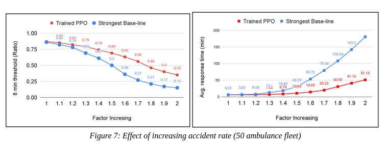
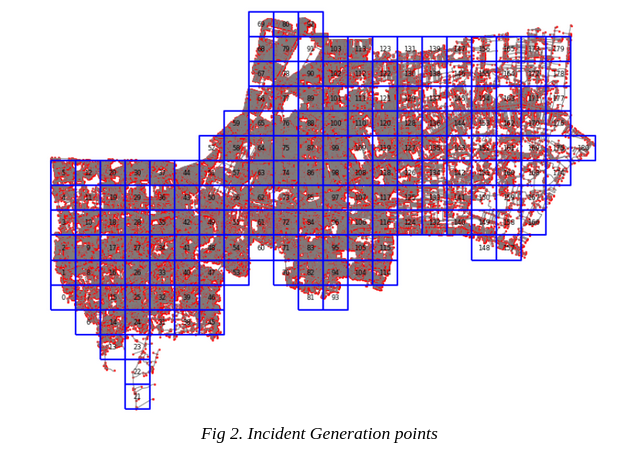
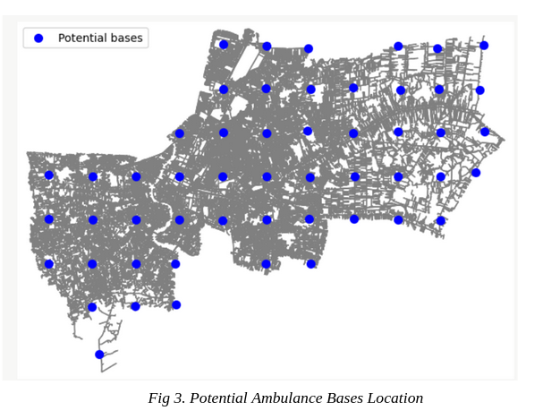

# Dynamic Ambulance Redeployment in Bangkok Using Deep Reinforcement Learning

A Deep Reinforcement Learning system for dynamic ambulance redeployment in Bangkok, Thailand. When an ambulance becomes available after dropping a patient at a hospital, a trained PPO agent recommends which base it should relocate to while optimizing future emergency response coverage.

## Results

Evaluated over 500 simulated days against baseline policies (35 ambulance fleet):

| Metric | DSM (best baseline) | PPO (ours) | Improvement |
|---|---|---|---|
| Avg. response time (min) | 9.02 | **7.11** | 21% reduction |
| Pick-up within 8 min | 0.72 | **0.78** | 8.3% improvement |
| 95th percentile response (min) | 21.08 | **16.38** | 22% reduction |
| Max response time (min) | 39.06 | **30.60** | 22% reduction |
| Relocation travel time (min) | 14.71 | **12.47** | 15% reduction |

The model also demonstrates robustness to unrecognized accident rate surges and changes in ambulance fleet size without retraining.


## How It Works

**Simulation Environment** ([`DES_ambo.py`](DES_ambo.py))

A Discrete Event Simulation built with SimPy and wrapped in a Gymnasium interface. Each episode simulates one day (1440 min) of ambulance operations in Bangkok:

1. Incidents arrive via non-homogeneous Poisson processes derived from real Bangkok accident data
2. Nearest available ambulance is dispatched
3. Ambulance travels to incident → nearest hospital → requests agent decision
4. Agent recommends a base to relocate to; ambulance travels there and becomes available again

**Spatial Setup**
- Bangkok divided into **52 grid cells** → potential ambulance bases

- Bangkok divided into **126 finer grid cells** → incident generation points

- Shortest-path distances pre-computed via A\* on OpenStreetMap road network and stored as lookup tables for fast access

**State Space (4 features)**
1. Current ambulance count at each base
2. avg demand per base per 2-hour period (12 periods/day)
3. Expected relocation travel time from current hospital to each base
4. Near-future coverage - expected arrival times of up to 3 returning ambulances per base

**Action**: Which of the 52 bases the available ambulance should relocate to

**Reward**: `R = -tanh(response_time - 8)` 
smooth signal centered at the 8-minute golden response threshold

**Initial Placement** ([`DSM_ambo.py`](DSM_ambo.py))

A Double Standard Model (linear program via PuLP) optimizes the initial number of ambulances per base to maximize double-covered demand at the start of each episode.

**Training** ([`parallel_train.py`](parallel_train.py))

PPO from Stable-Baselines3 with parallel env across all CPU cores.

Key hyperparameters:

| Parameter | Value |
|---|---|
| Total timesteps | 35 million |
| Network | MLP 2×512 (separate actor/critic) |
| Learning rate | Linear decay 3e-4 → 5e-6 |
| Discount factor (γ) | 0.99 |
| GAE (λ) | 0.95 |
| Clip range (ε) | 0.2 |
| Entropy coef. | 0.015 |

## Project Structure

```
DES_ambo.py               # Gymnasium DES environment
DSM_ambo.py               # Double Standard Model (initial placement optimizer)
parallel_train.py         # PPO training script (multi-CPU)
map_data_processing.ipynb # Spatial data preprocessing
data/
├── accident_rate.csv
├── ambulance_initialization.csv
├── distance_base_to_incident.csv
├── distance_hospital_to_base.csv
└── nearest_places_data.csv
```

## Dependencies

```
simpy
gymnasium
stable-baselines3
numpy
pandas
pulp
torch
```

## Usage

**1. Optimize initial ambulance placement:**
```bash
python DSM_ambo.py
```

**2. Train the PPO agent:**
```bash
python parallel_train.py
```
